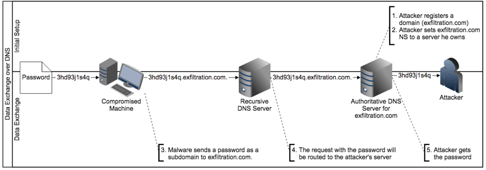

### Overview 

In the presence of security countermeasures, a malware designed for data exfiltration must do so using a covert channel to achieve its goal. Among existing covert channels stands the domain name system (DNS) protocol. Exfiltration of data via DNS queries is a method of breaching the confidentiality of an organization that is commonly available, hard to detect, and can provide indirect command and control (C2) channels between an attacker and compromised hosts.

### Techniques 

#### DNS Tunnelling

DNS tunneling is the process of transmitting data using DNS queries and responses. It can be used to transfer files or facilitate command and control with a compromised host, especially in environments where other methods may be closely monitored. If an attacker can issue external DNS queries from within an organization’s network, they will likely be able to exfiltrate data by tunneling it over DNS.

The first step of DNS tunneling is creating DNS records that will point any queries for a specific domain name to a server under the attacker’s control. After setting up and testing the records, the attacker will configure the server to act as an authoritative DNS server to itself and to listen for incoming DNS queries. They can then begin exfiltrating data by issuing virtually unlimited queries from a compromised host. Each DNS query will contain a chunk of stolen data in the subdomain portion of the request. For example, to exfiltrate credit card numbers along with their expiration dates and security codes, a string of queries may include subdomains that look like this:

5498560132569011x0876x699.example.com
9632554178950136x0612x322.example.com
3312457852014598x0337x026.example.com
3126598795620414x0122x258.example.com

Numerous open source tools are available to make this process easier for attackers, most of which implement server-side parsing techniques that automatically reconstruct or format data as it is received.

### DNS Encoding

+ DNS TXT records 
+ EDNS 

### Real case abuse

### Tools 

|
 
 Name | Description | Language |
| ------ | ----------- | ------ |
| [dnscat2](https://github.com/iagox86/dnscat2) | a DNS tunnel designed to create an encrypted C&C channel over the DNS protocol | Ruby |

### Research papers 

[Detection of Malicious and Low Throughput Data
Exfiltration Over the DNS Protocol](https://arxiv.org/pdf/1709.08395.pdf)

### Detection 

To detect DNS exfiltration, evaluation of namequery network traffic is required. The easiest way
to accomplish this is to enable query logging on nameservers; however, the servers can quickly
become overloaded with logging data if they are not sufficiently provisioned to handle this extra
load. Network sensors that can capture DNS traffic could also be used. Implementation of
network sensors is more difficult, but can yield better results as analysis of inbound and
outbound DNS traffic is generally easier.

Correlation of DNS queries to other proxy logs to determine whether the queries were the result
of legitimate service access is also very important. Outbound connection logs, including firewall
and other perimeter control devices, should be monitored in conjunction with DNS queries, and
any DNS query that does not result in a proxied outbound connection request should be
investigated.

### Mitigation 

To prevent DNS exfiltration from a protected network, ensure that DNS queries are not relayed
outside the trusted perimeter. This will prevent any information being leaked via DNS to
untrusted hosts.

Some IDS/IDPs are now capable of spotting DNS tunnelling.

### References 

[DNS as a Covert Channel Within Protected
Networks](https://www.researchgate.net/profile/Seth_Bromberger/publication/319492986_DNS_as_a_Covert_Channel_Within_Protected_Networks/links/59aed9e2a6fdcca6542425c5/DNS-as-a-Covert-Channel-Within-Protected-Networks.pdf)

[Detecting DNS Tunneling - SANS Institute](https://www.sans.org/reading-room/whitepapers/dns/detecting-dns-tunneling-34152)

[Conducting and Detecting Data Exfiltration](https://www.mindpointgroup.com/blog/operations/conducting-and-detecting-data-exfiltration/)